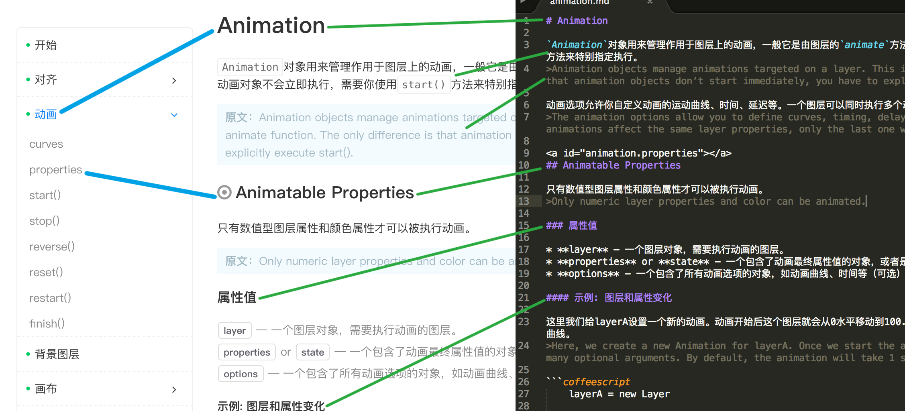
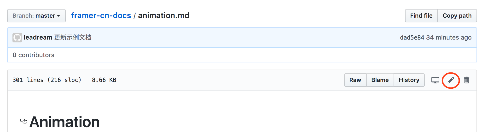
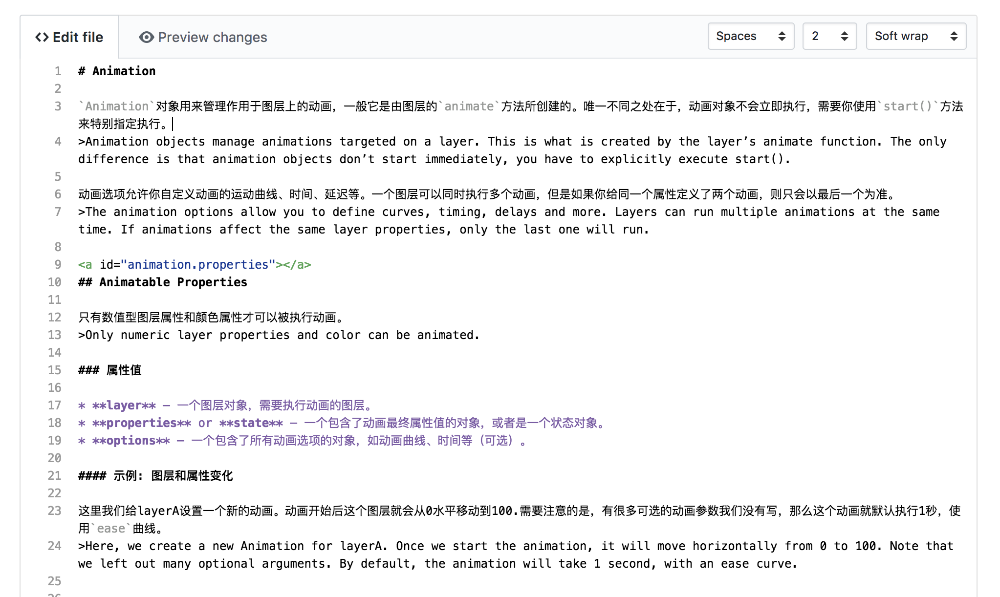
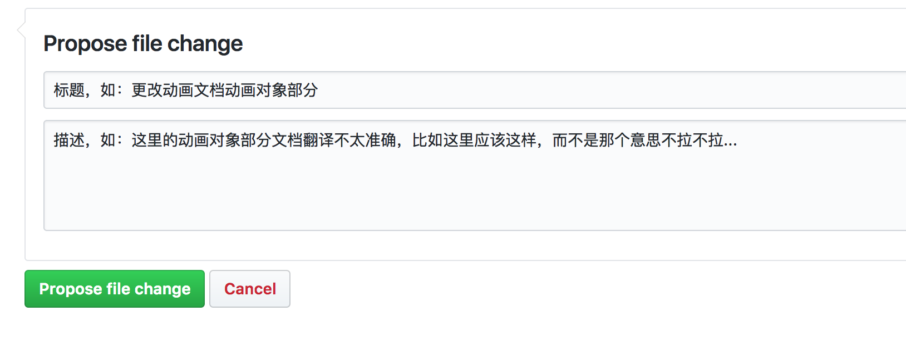

# Framer 中文文档翻译计划

这里是 Framer 中文网的中文文档。之前都是我一个人进行翻译，也没有人校对，这种方式不仅慢还很容易出错。所以我决定把中文文档放在 github 上面，这样大家就可以一起翻译，互相校对。如果你不擅长于翻译也没关系，当你发现中文有错误时也可以及时在这里更正。

## 必备条件
首先要说明一下，如果你想参与翻译计划，需要以下两个必备条件：

**1. 你需要会使用 Markdown 写东西**

**2. 你需要注册一个 github 账号**

不过不用担心，这都很简单，而且这两件事情对你以后学习 Framer 都是有帮助的。对于第一个条件，简单介绍一下 Markdown 。它可以通过简单的语法来实现各种不同的样式，其实它是一种书写规则。

比如，你可以这样写：

```markdown
# 大标题
```

它就会被解析成为这种样式：


这样在你编辑微信公众号文章，或者写邮件时，就不需要点击上面的按钮去把文字加粗、变大或变成斜体了，手不离键盘也能做好排版。

这里的所有文档都采用 Markdown 格式书写，如果你还不是很了解 Markdown 请参考[这里](https://sspai.com/post/25137)。

对于第二点我就不多说了，虽是英文站但不用翻墙，推荐使用常用邮箱注册。

## 格式



如上图**蓝色连线**所示，在书写时一共有四级标题。第一级标题只在每个章节最顶部出现一次，它对应着左边导航菜单的一级菜单；第二级标题对应着每一章节的属性或者方法，它对应着导航菜单的二级菜单。“属性值”一般是三级标题，“示例”一般是四级标题。

* **特别注意** 每个二级标题前面都有一句`<a id="animation.properties"></a>`，这是为了在 Framer 中文网中点击二级菜单可以跳到相应位置。请务必写上这个，并替换`animation.properties`为`该章节名称英文.该二级标题名称英文`。

上图中**绿色连线**标明了 Markdown 文件中每一块对应渲染之后的部分。刚开始我没有保留英文原文，但是后来保留了，所以你如果发现之前翻译的文档有一些没有英文原文可以补上。注意英文原文前面有`>`符号，表示引用。在所有中文段落中出现的关键词，比如`new`、`Layer`、`start()`请在两边加上`` ` ``符号用以突出。

每个段落或代码块之间都需要换行两次，保证每一块之间都隔一行。对于代码请使用下面的方式包裹：

``````coffeescript
```coffeescript

    layerA = new Layer

    # Animate the layer to the right
    animationA = new Animation
        layer: layerA
        properties:
            x: 100
```
``````

## 开始翻译

你可以在中文网每个章节文档页面看见编辑链接，点击它们就可以进入编辑页面了。当然你也可以进入 github 上对应章节，点击右上角的铅笔图标，进入翻译页面。



现在你可以在这里直接编辑文档了，请严格遵守上面讲述的格式。



编辑完成之后，滑到页面最后面，请详细地填写更新内容的标题和描述，再点击下面的绿色按钮提交。



你的更改不会立即生效，我会对它们进行最后的检查，如果没有问题就会通过并发布。

# 感谢

自从创建 Framer 中文网以来，我都是一个人负责所有事情，感谢在此期间支援我服务器费用的小伙伴们。一个人的力量终究有限，这也是到现在文档还没翻译完成的原因。这一次希望大家能够参与到翻译的事情中，让更多的小伙伴能够快速学习 Framer 。需要说明的是，翻译是志愿行为，我没有报酬给大家，但是大家有什么疑问我都会尽力解答。

再次感谢！

---------------------

请点击下面的章节名称去相应的地方编辑文档。

[start](https://github.com/leadream/framer-cn-docs/edit/master/start.md)

[align](https://github.com/leadream/framer-cn-docs/edit/master/align.md)

[animation](https://github.com/leadream/framer-cn-docs/edit/master/animation.md)

[backgroundLayer](https://github.com/leadream/framer-cn-docs/edit/master/backgroundLayer.md)

[canvas](https://github.com/leadream/framer-cn-docs/edit/master/canvas.md)

[color](https://github.com/leadream/framer-cn-docs/edit/master/color.md)

[compatibility](https://github.com/leadream/framer-cn-docs/edit/master/compatibility.md)

[defaults](https://github.com/leadream/framer-cn-docs/edit/master/defaults.md)

[device](https://github.com/leadream/framer-cn-docs/edit/master/device.md)

[draggable](https://github.com/leadream/framer-cn-docs/edit/master/draggable.md)

[events](https://github.com/leadream/framer-cn-docs/edit/master/events.md)

[extras](https://github.com/leadream/framer-cn-docs/edit/master/extras.md)

[flowComponent](https://github.com/leadream/framer-cn-docs/edit/master/flowComponent.md)

[layer](https://github.com/leadream/framer-cn-docs/edit/master/layer.md)

[midiComponent](https://github.com/leadream/framer-cn-docs/edit/master/midiComponent.md)

[modules](https://github.com/leadream/framer-cn-docs/edit/master/modules.md)

[pageComponent](https://github.com/leadream/framer-cn-docs/edit/master/pageComponent.md)

[pinchable](https://github.com/leadream/framer-cn-docs/edit/master/pinchable.md)

[print](https://github.com/leadream/framer-cn-docs/edit/master/print.md)

[rangeSliderComponent](https://github.com/leadream/framer-cn-docs/edit/master/rangeSliderComponent.md)

[screen](https://github.com/leadream/framer-cn-docs/edit/master/screen.md)

[scrollComponent](https://github.com/leadream/framer-cn-docs/edit/master/scrollComponent.md)

[sliderComponent](https://github.com/leadream/framer-cn-docs/edit/master/sliderComponent.md)

[states](https://github.com/leadream/framer-cn-docs/edit/master/states.md)

[textLayer](https://github.com/leadream/framer-cn-docs/edit/master/textLayer.md)

[utilities](https://github.com/leadream/framer-cn-docs/edit/master/utilities.md)

[videoLayer](https://github.com/leadream/framer-cn-docs/edit/master/videoLayer.md)
